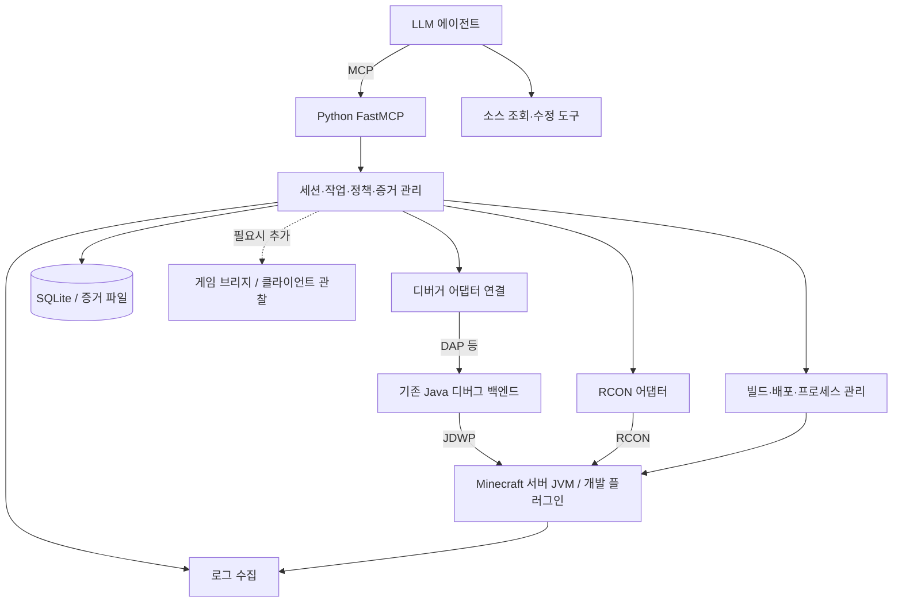

# CraftMCP 프로젝트 계획

수정일: 2026-10-06
상태: 설계 및 개발 계획. 아래 기능과 연결 방식은 아직 이 저장소에서 구현·실행 검증되지 않았다.

## 1. 목표와 첫 버전의 방향

**Java로 Minecraft 플러그인과 모드를 개발하는 사람이 에이전트를 통해 게임 상황과 코드 내부를 함께 조사하고, 오류를 수정한 뒤 실제 게임 결과를 검증할 수 있는 MCP를 만든다.**

첫 버전은 **Python FastMCP + RCON + JVM 디버거 연결 + 로그 수집**으로 시작한다. 기존 Java 디버거 기술을 재사용하고, Minecraft 내부에 설치하는 Java 게임 브리지는 필수로 만들지 않는다.

첫 번째로 입증할 것은 다음과 같다.

> 에이전트가 RCON으로 재현 가능한 플러그인 기능을 실행하고, 디버거로 변수와 호출 스택을 조사하고, 소스를 수정한 뒤 동일 조건에서 실제 게임 결과가 올바른지 확인할 수 있는가?

연결 성공이나 예외가 사라진 것만으로 완료하지 않는다. 코드의 계산 결과와 게임에서 발생한 결과를 함께 확인한다. LLM이 게임 상태를 추측하게 하는 것이 아니라 도구가 실제 데이터를 수집하고 LLM이 그 근거를 해석하도록 한다.

플러그인으로 시작하되 모드 개발 지원이라는 장기 목표는 유지한다. 게임 브리지, 클라이언트 관찰, Fabric/NeoForge 지원은 첫 실험에서 드러난 필요에 따라 확장한다.

## 2. 구성 요소와 용어

| 용어 | 의미 | 이 프로젝트의 역할 |
|---|---|---|
| 에이전트 | LLM과 도구를 사용해 작업하는 프로그램 | 조사 방향 결정, 소스 분석·수정, 결과 판단 |
| MCP | 호스트가 도구를 발견하고 호출하는 규약 | 에이전트와 CraftMCP 연결 |
| FastMCP | Python 함수를 MCP 도구로 노출하는 프레임워크 | 입력 검증, 도구 등록, 응답 전달 |
| RCON | 서버 콘솔 명령을 외부에서 실행하는 통신 방식 | 테스트 명령 실행과 명령으로 노출된 상태 조회 |
| JVM 디버거 | Java 프로그램의 실행 상태를 조사하는 도구 | 중단점, 호출 스택, 변수·객체 확인, 실행 재개 |
| JDWP | JVM과 디버거 사이의 통신 규약 | Minecraft 서버 JVM의 디버깅 접속 |
| JDI | JVM 디버깅 기능을 사용하는 Java API | 디버거 백엔드 구현에서 활용 가능 |
| DAP | 도구와 디버그 어댑터 사이의 통신 규약 | Python에서 기존 Java 디버거 기능 호출 후보 |
| 디버그 어댑터 | 요청을 받아 디버거 기능을 수행하는 프로그램 | Minecraft 외부에서 실행하는 디버깅 연결 계층 |
| 게임 브리지 | 게임 API로 상태·이벤트를 수집하는 플러그인/모드 | 필요해질 때 추가할 게임 관찰 계층 |

**디버그 어댑터와 게임 브리지 플러그인은 서로 다르다.** 디버거를 연결하기 위해 Minecraft의 `plugins/`에 브리지 JAR를 설치해야 하는 것은 아니다.

RCON은 통신 방식이고 게임 브리지는 프로그램의 역할이므로 양자택일도 아니다. 후속 브리지에 진단 명령을 추가해 RCON으로 호출할 수 있다. HTTP는 브리지 통신을 구현하는 선택지이며, MCP나 첫 버전의 필수 조건이 아니다.

FastMCP는 Minecraft API나 디버거를 자동 구현하지 않는다. Python 함수 내부에서 RCON 클라이언트, 디버그 어댑터, 로그 수집기를 호출하는 코드는 우리가 작성한다. 아래 개발 단계와 코드 계층 역시 FastMCP의 요구 사항이 아니라 프로젝트의 설계다. [FastMCP Tools](https://gofastmcp.com/servers/tools)

## 3. 현재 저장소와 기준 환경

| 항목 | 확인한 기존 기준 | 이번 계획 |
|---|---|---|
| Minecraft | 1.20.1 | 첫 실험 기준으로 유지 |
| Paper | 1.20.1 build 196 | 실제 설치·실행 검증 후 고정 |
| Java | Temurin 17 | 서버·플러그인의 첫 기준 |
| 플러그인 빌드 | Gradle | Wrapper 및 의존성 고정 |
| MCP 언어 | Python | Python·FastMCP 호환 버전 검증 후 잠금 |
| RCON | 서버 설정 예제와 비밀번호 환경 변수 예제 존재 | 실제 연결과 응답 검증 필요 |
| 구현 디렉터리 | `mcp_server/`, `plugin_template/`, `eval/` 등 | 단계별 코드 추가 |
| 설치 안내 | `docs/paper-server-setup.md` | RCON·디버거 설정과 재현 절차 보강 |

위 버전은 저장소의 기존 결정을 반영하며 최신 버전이라는 의미가 아니다. Python 패키지, RCON 라이브러리, Java 디버그 백엔드는 아직 확정하지 않는다. 공식 문서의 최신 예제는 Java 17과 Paper 1.20.1에 맞게 검증한다.

## 4. 무엇을 관찰해야 하는가

| 관찰 영역 | 확인할 정보 | 첫 수단 | 남는 한계 |
|---|---|---|---|
| 코드 내부 | 실행 위치, 호출 스택, 변수, 객체 필드 | JVM 디버거 | 디버그 정보와 소스·JAR 일치 필요 |
| 서버 게임 상태 | 플레이어·대상 엔티티·위치·체력 등 | RCON에서 실행 가능한 명령 | 전체 게임 상태나 이벤트 이력을 자동 제공하지 않음 |
| 실행 기록 | 예외, 원인 스택, 플러그인 로그 | 로그 파일/프로세스 출력 수집 | 기록되지 않은 정보는 복원 불가 |
| 실제 행동 | 스킬 사용, 클릭, 이동 | 콘솔로 재현 가능한 명령 또는 사람 | 콘솔 실행을 플레이어 입력과 동일시하지 않음 |
| 화면 | 렌더링, HUD, 시각 효과 | 첫 버전 자동 검증 범위 밖 | 필요하면 클라이언트 캡처 추가 |

RCON으로도 플러그인 명령과 동작 결과는 확인할 수 있다. 디버거는 그 명령을 처리하는 코드의 내부 판단을 조사한다. RCON만으로 필요한 상태를 얻기 어렵다면 진단 명령, 추가 로그, 게임 브리지 순으로 실제 요구에 맞는 수단을 검토한다.

플러그인 함수가 정상 종료되어도 잘못된 대상을 조작하거나 다른 기능과 충돌할 수 있다. 따라서 **코드 실행과 실제 게임 결과를 함께 검증**한다. 디버거·RCON을 연결했다고 모든 플러그인/모드 버그를 자동 해결할 수 있다고 주장하지 않는다.

## 5. 권장 아키텍처



첫 MCP 전송 방식은 로컬 stdio다. Python의 일반 로그는 stderr 또는 파일로 보내고 MCP stdout과 섞지 않는다. 원격 MCP 제공은 후속 과제다. [FastMCP 실행 방식](https://gofastmcp.com/deployment/running-server)

MCP 도구 계층은 입력·결과 변환을, 서비스 계층은 조사·실행 순서를, 어댑터는 외부 시스템 연결을 담당한다. 처음에는 하나의 Python 프로그램 안에서 모듈로 나누며 별도 웹 서비스나 메시지 브로커를 도입하지 않는다.

소스 편집은 기존 코딩 에이전트의 파일 도구를 활용한다. CraftMCP는 Minecraft 실행·관찰·검증에 집중한다. 이미 에이전트에 디버거 도구가 있다면 중복 구현 전에 호환성과 증거 연계 가능성을 평가한다.

## 6. RCON 연결 설계

서버에서 RCON을 활성화하고 Python 라이브러리로 접속·인증·명령 송수신을 수행한다. 라이브러리는 게임별 고수준 도구를 자동 제공하지 않으므로 명령 생성과 응답 해석은 별도로 구현한다. [Paper 서버 설정](https://docs.papermc.io/paper/reference/server-properties/)

- 라이브러리 선정 시 Java 17/Paper 기준 서버와의 인증, 시간 초과, 긴 응답, 연결 종료·재접속을 검증한다.
- 접속자 목록과 등록된 테스트 명령부터 시작한다. 응답은 원문과 해석된 값을 함께 보존한다.
- 콘솔 명령은 게임 채팅의 플레이어 실행과 실행 주체가 다를 수 있다. 플레이어 전용 기능은 같은 방식으로 재현된다고 가정하지 않는다.
- 상태 조회는 지원되는 명령으로 가능한 필드만 반환한다. 지원하지 않는 정보를 빈 성공 결과로 포장하지 않는다.
- 명령이 네트워크로 전달된 것과 게임에서 성공한 것을 구분한다. 명령 출력과 실제 상태를 대조한다.
- 변경 명령은 응답 유실 후 자동 재전송하지 않는다. 실행 여부가 불명확하면 결과를 먼저 조사한다.
- 첫 구현에서는 요청별 연결 또는 명시적 직렬화로 응답이 다른 요청에 섞이지 않게 한다.
- RCON은 전체 서버 로그 스트림이 아니다. 로그 수집 경로를 따로 둔다.

## 7. JVM 디버거 연결 설계

### 7.1 JVM 연결

서버 JVM을 JDWP 옵션으로 실행한다. 예시는 기존 JAR 이름을 사용하며 실제 파일 존재·실행 성공을 의미하지 않는다.

```text
java -agentlib:jdwp=transport=dt_socket,server=y,suspend=n,address=127.0.0.1:5005 -jar paper-1.20.1-196.jar nogui
```

- `server=y`: JVM이 디버거 접속을 받는다.
- `suspend=n`: 연결 전에도 서버를 실행한다. 시작 초기 오류를 조사할 때만 별도의 시작 일시정지 설정을 사용한다.
- `127.0.0.1:5005`: 같은 컴퓨터에서 디버깅한다. RCON 포트와 별개다.

플러그인이 실행되는 서버 JVM에 연결하므로 별도 게임 브리지 설치가 필수는 아니다. [Paper 디버깅](https://docs.papermc.io/paper/dev/debugging/), [Oracle JDWP 연결 옵션](https://docs.oracle.com/en/java/javase/17/docs/specs/jpda/conninv.html)

### 7.2 백엔드 선정 실험

우선 기존 Java DAP 백엔드 재사용을 검토한다. DAP는 도구와 디버그 어댑터 사이의 규약이며 JVM에 직접 보내는 규약은 아니다. Microsoft Java Debug 등은 후보이지 확정 의존성이 아니다. [DAP 개요](https://microsoft.github.io/debug-adapter-protocol/overview.html), [Microsoft Java Debug](https://github.com/microsoft/java-debug)

선정 전에 다음을 실제 실행으로 확인한다.

1. Windows에서 백엔드를 시작하고 Python에서 연결할 수 있는가?
2. IDE·Java language server·프로젝트 모델 의존성이 무엇이며 독립 실행 구성이 가능한가?
3. Paper JVM에 attach하고 샘플 플러그인의 소스 줄을 로드된 클래스에 매핑할 수 있는가?
4. 중단점 검증, 중단 이벤트, 호출 스택, 변수 조회, 실행 재개가 가능한가?
5. Java 17 호환성, 배포 라이선스, 설치 크기와 유지보수 비용이 적절한가?

후보가 프로젝트에 적합하지 않으면 다른 백엔드 또는 JDI 기반의 작은 외부 헬퍼를 비교한다. JDI 헬퍼가 Java로 작성되더라도 Minecraft 플러그인으로 설치하는 게임 브리지와는 다르다. Python에서 JDWP 전체를 새로 구현하는 것은 첫 선택으로 삼지 않는다.

### 7.3 디버그 세션 관리

- 상태: `disconnected`, `connecting`, `running`, `stopped`, `terminated`.
- JVM 연결 성공과 중단점이 실제로 적용된 상태를 구분한다. 클래스 미로딩 또는 소스 불일치는 별도 표시한다.
- 소스 리비전, 배포 JAR 해시, 런타임 부팅 ID, 디버그 세션 ID를 연결한다.
- 줄 번호·지역 변수는 빌드 디버그 정보에 의존한다. 샘플 빌드에서 이를 명시적으로 검증한다.
- 스택 프레임·변수 참조는 중단 시점에 속한다. 실행 재개·step·재연결 이후 이전 참조를 재사용하지 않는다.
- 첫 기능은 attach, 중단점, 중단 상태 조회, 스택·변수 조회, continue, detach로 제한한다. step과 예외 중단점은 다음 확장으로 둔다.
- 임의 표현식 평가·메서드 호출·변수 변경은 부작용이 있으므로 첫 버전의 기본 조회 기능에 포함하지 않는다.
- 세션 종료 정책을 명확히 하고 테스트 후 서버를 중단 상태로 방치하지 않는다. 재개 실패는 사용자 조치가 필요한 상태로 기록한다.

### 7.4 RCON과 디버거의 동시 처리

**RCON 명령 처리 중 중단점에 도달하면 RCON 응답도 대기할 수 있다.** 하나의 동기 호출이 끝날 때까지 모든 도구 처리를 막는 구조를 피한다.

- 테스트 명령은 `job_id`를 반환하고 백그라운드에서 실행한다.
- 디버거 이벤트 수신은 RCON 작업과 독립적으로 동작한다.
- 중단 상태를 조회하고 변수 확인·실행 재개를 할 수 있어야 한다.
- 서버 주 스레드가 멈춘 동안 게임 명령을 추가로 보내면 대기할 수 있다. 필요하면 먼저 재개하도록 안내한다.
- 네트워크 요청 제한 시간과 의도된 디버그 중단 시간을 구분한다. 시간 초과를 명령 미실행으로 해석하지 않는다.
- 중단으로 틱 진행, 접속 유지, watchdog 동작에 영향이 생길 수 있다. 전용 개발 서버에서 시험하고 디버깅용 설정을 따로 기록한다.
- 실제 기능 검증은 마지막에 중단점을 제거하거나 비활성화하고 정상 실행 상태에서 반복한다.

## 8. 첫 MCP 도구 목록

아래 이름과 입력은 설계 초안이다. 도구를 거대한 범용 셸로 만들지 않고 목적별로 제한한다.

| 도구 | 핵심 입력 | 결과 |
|---|---|---|
| `get_runtime_status` | 런타임 ID | 서버, RCON, 디버거 연결 상태와 지원 기능 |
| `list_players` | 런타임 ID | 접속자 응답 원문과 해석 결과 |
| `inspect_game_state` | 대상, 허용된 조회 필드 | 명령으로 검증 가능한 상태와 관찰 시점 |
| `run_test_command` | 등록된 명령 프로필, 검증된 인자 | 작업 ID |
| `get_job` | 작업 ID | 명령/빌드/배포 진행 상태와 증거 |
| `query_logs` | 시간 구간/커서, 필터, 개수 | 예외와 로그 발췌 |
| `attach_debugger` | 등록된 런타임, 소스 프로젝트 | 디버그 세션 ID |
| `set_breakpoint` | 세션, 소스 경로, 줄 | 적용/대기/실패 상태 |
| `get_debug_state` | 세션 | 실행/중단 상태, 중단 원인, 스레드 |
| `get_stack_trace` | 세션, 중단 ID, 스레드 | 호출 스택 |
| `get_variables` | 세션, 중단 ID, 프레임/객체 참조 | 제한된 변수·필드 |
| `resume_execution` | 세션, 중단 ID | 재개 상태 |
| `detach_debugger` | 세션 | 중단 정리와 연결 종료 결과 |
| `build_project` | 등록된 프로젝트, 빌드 프로필 | 작업 ID와 최종 산출물 해시 |
| `deploy_artifact` | 관리 서버, 산출물 ID | 재시작·로딩 검증 작업 ID |

빌드·배포는 연결 실험 이후 개발 루프 단계에서 추가한다. 디버거 중단 이벤트를 받았다고 LLM이 자동으로 깨어난다고 가정하지 않는다. 에이전트가 상태를 조회하거나 호스트가 지원하는 제한된 이벤트 대기 방식으로 처리한다.

## 9. 로그와 증거 모델

각 테스트에 `run_id`를 부여하고 다음을 연관시킨다.

- Minecraft/Paper/Java 버전, 플러그인 버전, 소스 리비전과 JAR 해시.
- 런타임 부팅 ID, 디버그 세션 ID, 중단 ID, 명령 작업 ID.
- 실행 명령, 원문 응답, 로그 구간, 게임 상태 전후 값.
- 중단 원인, 호출 스택, 확인한 변수와 수집 시점.
- 기대 결과, 실제 결과, 통과/실패/미검증 사유.

UTC 시간과 순서를 기록한다. RCON 조회 여러 개를 같은 틱의 원자적 스냅샷이라고 표현하지 않는다. 로그와 게임 이벤트에 실행 ID가 없는 경우 시간 구간상 관련 자료로 표시하고 인과관계를 확정하지 않는다.

Python은 서버 로그 파일 또는 관리 프로세스 출력을 수집한다. 다중 행 예외, `Caused by`, 로그 회전·잘림, 중복을 처리한다. 디버거가 연결되지 않는 시작 실패도 로그로 남긴다.

결과는 `succeeded`, `failed`, `pending`, `unknown` 등 실행 여부를 구분하고 `observed_at`, `evidence_ids`, `warnings`, 필요시 `next_cursor`를 포함한다. 연결이 끊긴 뒤 이전 값을 현재 상태로 반환하지 않는다. 오류는 도구 실패로 인식되도록 전달한다.

저장은 SQLite와 증거 파일로 시작한다. 로그·변수·객체를 무제한 반환하지 않으며 깊이·항목 수·문자 수·보존량을 제한한다. 객체 참조 순환도 처리한다.

## 10. 첫 검증 시나리오

샘플 플러그인에 콘솔에서 실행할 수 있는 테스트 명령을 만든다. 실제 플레이어 동작 전체를 대신한다고 주장하지 않는다.

**예시 결함:** 등록된 테스트 몬스터 두 마리 중 잘못된 대상을 선택해 피해를 주는 버그.

1. 고정된 테스트 월드와 식별 가능한 몬스터 A/B를 준비한다.
2. RCON 조회로 각 대상의 식별자와 체력 기준값을 기록한다.
3. 대상 선택 코드에 중단점을 설정한다.
4. RCON 테스트 명령을 작업으로 시작한다.
5. 중단 이벤트를 확인하고 선택된 대상과 피해량을 디버거로 조사한다.
6. 실행을 재개하고 두 몬스터의 실제 체력 변화를 조회한다.
7. 에이전트가 소스의 원인과 관찰 근거를 연결해 수정한다.
8. 재빌드·배포 후 소스와 JAR 해시를 갱신한다.
9. 같은 초기 상태를 복원하고 중단점 없이 다시 실행한다.
10. 기대 대상만 기대한 만큼 피해를 받았는지 assertion으로 판정한다.

명령으로 해당 상태를 안정적으로 조회할 수 있는지는 초기 실험에서 확인한다. 불가능하면 테스트 명령의 진단 출력 또는 최소 추가 계측을 사용하고 실제 지원 범위를 기록한다.

완료 증거는 수정 전 실패와 수정 후 통과 모두를 포함한다. 이 시나리오의 성공은 화면, 플레이어 클릭, 모든 플러그인 동작의 검증을 의미하지 않는다.

## 11. 빌드·배포와 실행 경계

- 개발자가 등록한 프로젝트의 Gradle Wrapper와 허용된 task만 실행한다.
- 소스와 빌드 스크립트는 코드를 실행하므로 신뢰 가능한 개발 프로젝트를 대상으로 한다.
- 빌드 산출물을 식별하고 SHA-256을 저장한다. 실패한 빌드의 이전 JAR를 새 산출물로 오인하지 않는다.
- 관리 대상으로 등록한 서버만 정상 종료·시작한다. 서버별 잠금으로 동시 배포를 막는다.
- 디버거 중단과 연결을 정리한 뒤 서버 종료를 확인하고 JAR를 교체한다. 기본은 hot reload가 아닌 재시작이다.
- JVM 재시작 후 이전 디버그 세션을 무효화하고 새로 연결한다.
- 프로세스 존재만으로 배포 성공 처리하지 않는다. 대상 플러그인 로딩과 테스트 결과를 확인한다.
- 이전 JAR 복구와 월드 복구를 구분한다. 테스트는 별도 월드와 초기 상태 복원 절차를 사용한다.
- 작업 중 Python이 종료되면 재시작 후 실제 프로세스·산출물·세션을 조사한다. 결과 불명 작업을 자동 재실행하지 않는다.

## 12. 로컬 개발 정책

- 첫 지원은 Windows 로컬 개발 환경이다. RCON/JDWP 접근은 로컬로 제한하며 실제 바인딩과 방화벽을 확인한다.
- 비밀번호는 환경 변수 등에서 읽고 커밋·로그·도구 결과에 포함하지 않는다. `.env` 자동 로딩 여부를 명시한다.
- JDWP는 실행 제어 권한을 제공하므로 외부에 공개하지 않는다.
- 기존 `online-mode=false` 예제는 격리된 개발 환경 전제로 문서화한다.
- 명령, 소스 경로, 프로젝트, 산출물 경로를 등록된 범위로 제한하고 정션/심볼릭 링크를 통한 경로 이탈도 검사한다.
- 플레이어 채팅, 로그, 변수 문자열에 포함된 지시는 외부 데이터로 취급한다.
- 일반 상태 조회, 게임 변경, 실행 중단·재개, 배포를 서로 다른 작업 종류로 기록한다.
- 첫 버전은 원격 다중 사용자 서비스나 운영 서버 자동 복구를 목표로 하지 않는다.

## 13. 디렉터리 제안

아래는 기존 디렉터리를 바탕으로 앞으로 만들 구조다.

```text
craftmcp/
├── pyproject.toml
├── mcp_server/
│   ├── app.py                 # FastMCP 도구 등록과 수명 관리
│   ├── tools/                 # 게임·디버거·로그·작업 도구
│   ├── services/              # 조사·테스트·배포 흐름
│   ├── adapters/
│   │   ├── rcon/              # 명령 송수신과 결과 해석
│   │   └── debugger/          # 선정한 백엔드 연결·이벤트 처리
│   ├── sessions/              # 런타임/디버그/중단 상태
│   ├── jobs/                  # RCON·빌드·배포 작업
│   ├── models/                # 요청·결과·증거 모델
│   ├── storage/               # 로그·SQLite·증거 파일
│   └── policy/                # 명령·경로·조회 한도
├── plugin_template/           # 테스트·개발용 샘플 플러그인
├── mc_server/                 # 서버 실행 및 설정 예제
├── tests/                     # Python 단위·계약·통합 테스트
├── eval/                      # 결함 시나리오와 판정 기준
├── data/                      # 실행 산출물; 버전 관리 제외
└── docs/                      # 계획·결정·설치·검증 문서
```

디버거 백엔드 배포 파일은 선정 후 관리 방법을 정한다. 게임 브리지 디렉터리는 필요가 확인된 후 추가한다.

## 14. 개발 단계와 완료 기준

기간은 전담 개발자 1명 기준의 초기 추정이다. 특히 디버거 백엔드 통합 난이도는 실행 실험 전 확정할 수 없다.

| 단계 | 추정 | 작업 | 완료 기준 |
|---|---|---|---|
| 0. 기준 환경 | 2~3일 | 서버·Java·샘플 빌드, Python 환경, 설정 안내 | 같은 문서로 환경 재현 가능 |
| 1. RCON·로그 | 3~5일 | 인증, 명령 작업, 상태 조회, 로그 수집 | 실제 MCP 호스트에서 명령 실행과 게임 데이터 조회 |
| 2. 디버거 연결 실험 | 3~7일 | 백엔드 선정, attach, 소스 매핑, 중단점·변수·재개 | 실제 샘플 플러그인 중단점에서 변수 확인 후 서버 정상 재개 |
| 3. 통합 진단 | 1~2주 | RCON과 중단 이벤트 동시 처리, 증거 연결 | RCON 응답 대기 중에도 디버거 도구 작동; 결함 원인 확인 |
| 4. 수정·재검증 | 1~2주 | 빌드·배포·상태 복원·assertion | 수정 전 실패와 수정 후 정상 게임 결과를 실제 MCP/서버에서 확인 |
| 5. 관찰 범위 확장 | 별도 산정 | 부족한 이벤트·화면·모드 지원 | 기능별 필요성·호환성·완료 기준을 먼저 정의 |

일정은 단계 2가 끝난 뒤 다시 산정한다. 첫 우선순위는 다음과 같다.

- [ ] 서버와 샘플 플러그인 실행 기준 확보.
- [ ] Python RCON 라이브러리 후보의 실제 연결 검증.
- [ ] FastMCP 접속자 조회와 테스트 명령 작업 구현.
- [ ] 서버 로그 수집 및 예외 조회 구현.
- [ ] Java 디버그 백엔드 시작·연결 가능성 검증.
- [ ] 중단점 → 변수 조회 → 재개 흐름을 MCP로 연결.
- [ ] RCON 명령 대기와 디버거 조작의 동시 처리 검증.
- [ ] 수정 전후 게임 상태를 판정하는 첫 결함 시나리오 완성.

## 15. 테스트와 품질 기준

| 검증 종류 | 핵심 항목 |
|---|---|
| 단위 테스트 | 응답 해석, 예외 파싱, 경로/명령 검증, 세션 상태 전이 |
| 어댑터 계약 | 요청·응답·중단 이벤트, timeout, 오래된 프레임 참조 거절 |
| 실제 서버 통합 | RCON 실행, 잘못된 인증, 로그 회전, 서버 종료·재시작 |
| 실제 디버거 통합 | 소스 불일치, 클래스 미로딩, 중단·재개·detach, 연결 단절 |
| 교차 동작 | RCON 작업이 중단점에서 대기하는 동안 변수 조회·재개 가능 |
| 전체 사용 흐름 | 원인 조사 → 소스 수정 → 빌드·배포 → 동일 조건의 게임 결과 검증 |

중단점에 멈춰 있는 시간은 일반 호출 지연과 별도 측정한다. 게임 상태 응답에는 관찰 시점과 제한을 표시한다. 명령 실패, 시간 초과, 실행 여부 불명, 데이터 미지원 상태를 구분한다.

릴리스 결과는 **구현 완료 / 로컬 자동 테스트 / 실제 Minecraft 확인 / 실제 디버거 확인 / 실제 MCP 호스트 확인 / 미검증**으로 나눈다. 에이전트 평가에서는 정답뿐 아니라 사용한 근거, 불필요한 호출, 잘못된 원인 단정도 기록한다.

## 16. 후속 확장을 선택하는 기준

| 드러난 요구 | 우선 검토할 해결책 |
|---|---|
| 특정 플러그인의 업무 상태가 필요 | 해당 플러그인의 진단 명령 또는 공개 API |
| 명령으로 조회 불가능한 게임 이벤트·순간 상태가 필요 | 최소 Java 게임 브리지 |
| 지역 변수·호출 경로 조사가 부족 | 디버거 step/예외 중단점 등 확장 |
| 플레이어 입력으로만 재현 가능 | 사람과 협업 또는 테스트 클라이언트 |
| 화면·HUD·렌더링 오류 확인 필요 | 클라이언트 로그·화면 캡처 |
| Fabric/NeoForge 모드 지원 필요 | 로더별 실행·소스 매핑·RCON 지원·클라이언트 JVM 검증 |

게임 브리지는 비용 대비 필요한 관찰 기능이 확인되었을 때 도입한다. RCON과 함께 사용할 수 있으며 HTTP를 반드시 사용할 필요도 없다. 게임 브리지만으로 다른 플러그인의 모든 비공개 상태나 실제 화면을 자동 확인할 수 있다고 가정하지 않는다.

## 17. 테스트 클라이언트와 QA 확장

CraftMCP에 테스트 클라이언트 제어와 결과 조회를 연결하면 에이전트가 QA 시나리오를 수행할 수 있다. 여기서 테스트 클라이언트는 게임에 접속해 행동을 수행하는 프로그램이고, LLM 에이전트는 시나리오를 선택·실행하고 실패를 조사하는 역할이다. 모든 이동 프레임이나 패킷을 LLM이 직접 결정하게 하지 않고, 재현 가능한 행동 단위를 클라이언트 제어기가 실행한다.

| 테스트 수준 | 수행 방법 | 검증 범위와 한계 |
|---|---|---|
| 명령 기반 통합 테스트 | RCON으로 등록된 시나리오 실행 | 서버 로직과 상태 변화 확인; 실제 플레이어 입력을 대체하지 않음 |
| 프로토콜 클라이언트/봇 | 플레이어처럼 접속해 이동·채팅·상호작용 | 서버가 처리하는 플레이어 동작 확인; 실제 렌더링·HUD·모드 클라이언트 검증은 아님 |
| 실제 Minecraft 클라이언트 | 게임 입력 제어, 클라이언트 로그·상태·화면 수집 | 실제 UI·렌더링·클라이언트 모드 검증; 추가 연동과 환경 관리 필요 |

라이브러리나 클라이언트 구현은 아직 선정하지 않는다. 대상 버전, 로그인 방식, 필요한 상호작용, 모드 호환성, Windows 실행 가능성을 검증한 뒤 결정한다. 테스트 봇이 실제 게임 클라이언트와 같은 동작을 모두 구현한다고 가정하지 않는다.

권장 흐름은 다음과 같다.

```text
LLM QA 에이전트 → MCP 시나리오 도구 → 테스트 클라이언트 제어기
→ 접속·행동 실행 → 서버/클라이언트 증거 수집 → 명시적 assertion 판정
→ 실패 시 로그·디버거로 조사 → 수정·배포 → 중단점 없는 재실행
```

예시 시나리오는 테스트 계정으로 접속해 특정 위치로 이동하고, 아이템을 사용한 뒤 지정 몬스터의 체력 변화와 보상 지급을 확인하는 것이다. 실제 화면이 검증 대상이면 캡처와 클라이언트 상태도 함께 확인한다. 최초 QA는 사람이 재현하고 도구가 관찰하는 방식으로 시작할 수 있다.

- 시나리오에는 초기 월드/인벤토리/엔티티 상태, 행동 순서, 대기 조건, 제한 시간, 기대 결과, 정리 절차를 포함한다.
- `start_test_client`, `perform_test_action`, `get_client_state`, `run_scenario`, `get_test_result` 등을 후속 도구 후보로 둔다.
- 성공 기준은 예를 들어 대상 체력, 인벤토리 수량, 이벤트 발생처럼 검증 가능한 assertion으로 정의한다. LLM의 인상만으로 회귀 테스트를 통과시키지 않는다.
- 기대 조건을 미리 정하고 상태를 기다린다. 임의의 고정 sleep에만 의존하지 않는다. 재시도와 간헐 실패는 숨기지 않고 별도 기록한다.
- 여러 테스트가 월드와 계정을 공유해 영향을 주지 않도록 격리하고 테스트 종료 후 원상 복구한다.
- 디버거 연결과 중단으로 발생한 시간 변화는 QA 결과와 분리한다. 최종 통과는 정상 실행 속도에서 재검증한다.
- 봇 테스트 통과를 실제 화면·전체 모드 호환성 통과로 확대하지 않는다. 테스트 종류와 관찰 범위를 결과에 명시한다.

QA 자동화는 단계 4의 명령 기반 시나리오에서 시작하고, 클라이언트가 필요한 재현 사례를 확보한 뒤 단계 5에서 확장한다. 첫 버전에 범용 자율 플레이 에이전트까지 포함하지 않는다.

## 18. 참고 자료

아래 공식 자료는 설계 근거다. 실제 패키지 선택과 버전 호환성은 단계 0~2에서 검증한다. 도구 이름, 디렉터리, 일정은 프로젝트 제안이며 기존 제품의 제공 기능 목록이 아니다.

- [FastMCP Tools](https://gofastmcp.com/servers/tools)
- [FastMCP 실행 방식](https://gofastmcp.com/deployment/running-server)
- [Paper 서버 설정](https://docs.papermc.io/paper/reference/server-properties/)
- [Paper 플러그인 디버깅](https://docs.papermc.io/paper/dev/debugging/)
- [Oracle Java 17 JDWP 연결 옵션](https://docs.oracle.com/en/java/javase/17/docs/specs/jpda/conninv.html)
- [Oracle Java 17 JDI](https://docs.oracle.com/en/java/javase/17/docs/api/jdk.jdi/com/sun/jdi/package-summary.html)
- [Debug Adapter Protocol 개요](https://microsoft.github.io/debug-adapter-protocol/overview.html)
- [Microsoft Java Debug — 후보 백엔드](https://github.com/microsoft/java-debug)
