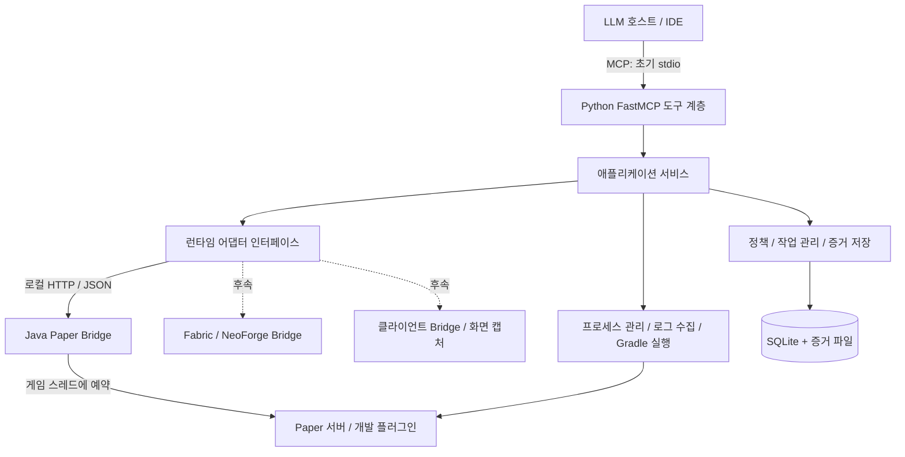

# CraftMCP 프로젝트 계획 및 아키텍처 제안

작성일: 2026-10-06  
상태: 설계 제안. 아래 구성과 도구는 아직 구현·실행 검증되지 않았다.

## 1. 프로젝트 목표

**Java로 Minecraft 플러그인과 모드(mod)를 개발하는 사람이 LLM과 함께 실행 중인 게임을 관찰하고, 오류를 재현하고, 수정 결과를 검증할 수 있는 개발용 MCP를 만든다.**

대표 사용 흐름은 다음과 같다.

1. 개발자가 “이 플러그인에서 블록을 부수면 오류가 나는데 확인해 줘”라고 요청한다.
2. LLM이 CraftMCP로 서버 버전, 설치된 플러그인, 최근 예외와 주변 게임 상태를 확인한다.
3. 개발자 또는 테스트 클라이언트가 같은 동작을 수행하면 CraftMCP가 관련 이벤트와 로그를 수집한다.
4. LLM이 예외의 위치와 재현 근거를 설명하고, 연결된 개발 도구로 Java 코드를 수정한다.
5. CraftMCP가 변경된 프로젝트를 빌드하고 개발 서버에 배포한 후 같은 시나리오를 재검증한다.
6. 개발자는 변경 전후의 로그, 상태, 테스트 결과와 필요시 화면을 확인한다.

핵심 가치는 단순한 콘솔 명령 실행이 아니라 **관찰 → 재현 → 진단 → 수정 → 재검증**을 근거와 함께 연결하는 데 있다. 모든 버그를 자동 수정한다고 약속하지 않고, 확인된 사실과 원인 후보를 구분한다.

## 2. FastMCP에 대한 이해와 구현 범위

“LLM이 사용할 함수를 MCP tool로 제공한다”는 이해는 맞다. 다만 각 도구를 별도의 REST API로 먼저 만들 필요는 없다. FastMCP는 Python 함수와 타입 정보를 바탕으로 MCP 도구를 노출한다. LLM을 실행하는 호스트가 도구를 선택하고 호출하며, FastMCP 자체가 오류 원인을 추론하는 것은 아니다. [FastMCP Tools](https://gofastmcp.com/servers/tools)

이 프로젝트에서는 두 통신 경계를 구분한다.

- **LLM 호스트 ↔ Python:** MCP. 개발 도구가 호출할 함수, 입력 스키마, 결과 형식을 제공한다.
- **Python ↔ Minecraft:** 자체 Bridge API. Minecraft JVM 내부의 상태와 이벤트를 Python에 전달하고 허용된 작업을 실행한다.

Python에서 게임 내부 객체에 직접 접근할 수 있는 것으로 설계하면 안 된다. 따라서 **Python 중심의 MCP 서버 + 얇은 Java 브리지**가 권장 구조다. 초기부터 별도 웹 대시보드, LLM API 호출 서버, 메시지 브로커까지 만들 필요는 없다.

소스 편집은 기존 IDE/코딩 에이전트가 담당하고, CraftMCP는 Minecraft 실행 환경과 검증에 집중한다. 추후 소스 조회를 추가하더라도 임의 파일 편집·셸 실행 기능으로 범위를 넓히지 않는다.

## 3. 현재 저장소와 첫 지원 대상

현재 확인한 저장소는 Python·Java 구현 전의 기본 디렉터리와 서버 실행용 파일을 갖춘 상태다. 서버가 실제 설치·실행된 상태인지는 이번 문서 작업에서 검증하지 않았다.

| 항목 | 저장소에서 확인한 기준 | 제안 |
|---|---|---|
| Minecraft / Paper | `docs/decisions.md`: 1.20.1 / Paper build 196 | 첫 호환성 검증 대상으로 유지 |
| Java | 같은 문서: Temurin 17 | 첫 Paper 브리지의 기준 |
| 빌드 | Gradle | Wrapper 및 의존성 버전 고정 |
| MCP 언어 | Python | 독립 `fastmcp` 패키지 사용 |
| Python / FastMCP 버전 | 미정 | 단계 0에서 호환 조합을 실행 검증하고 lockfile에 고정 |
| 통신 설정 | RCON 예제 존재 | 초기 진단 수단으로 활용 가능, 주 기능은 Bridge API |
| 서버 설치 가이드 | `docs/paper-server-setup.md` 내용 없음 | 재현 가능한 설치·실행 절차 보강 |

Paper 1.20.1을 현재 최신 또는 현재 권장 버전으로 판단한 것은 아니다. 기존 선택을 첫 기준으로 사용하며, 최신 공식 문서의 예제를 그대로 복사하지 않고 대상 API에서 컴파일·실행되는지 확인한다. Fabric 및 NeoForge 지원 시에는 각각의 Minecraft·로더·Java 버전 조합을 별도 확정한다.

## 4. 제품 범위와 지원 순서

| 단계 | 대상 | 제공할 가치 | 명확한 한계 |
|---|---|---|---|
| 첫 MVP | 로컬 Paper 서버 + Java 플러그인 | 상태·로그·이벤트 조회, 오류 재현 기록 | 실제 클라이언트 화면과 렌더링은 확인 불가 |
| 개발 루프 완성 | 관리되는 Paper 개발 서버 | 빌드·배포·재시작·시나리오 재검증 | 일반 운영 서버의 무중단 배포는 제외 |
| 화면 관찰 | 선택적 Fabric 클라이언트 모드 | 게임 화면, HUD, 클라이언트 로그 수집 | 접속 가능한 버전 조합과 렌더링 검증 필요 |
| 모드 개발 지원 | Fabric 서버·클라이언트 어댑터 | 모드 로딩 오류와 양쪽 상태의 연관 분석 | Paper 플러그인과 동일 런타임으로 취급하지 않음 |
| 후속 확장 | NeoForge, 원격 서버, 다중 프로젝트 | 지원 범위 확대 | 개별 호환성 테스트 통과 후 제공 |

Folia, 모든 과거 Minecraft 버전, 범용 GUI 자동 조작, Java 디버거 전체 대체, 운영 서버 자동 복구는 첫 MVP에서 제외한다.

사용자가 말하는 “실시간 확인”은 다음 세 수준으로 나눈다.

1. **상태 관찰:** 플레이어 위치, 블록, 엔티티, 서버 상태를 최근 시점의 데이터로 조회한다.
2. **실행 관찰:** 이벤트·예외·로그를 지속 수집하고 요청한 구간을 조회한다.
3. **시각 관찰:** 실제 Minecraft 클라이언트가 렌더링한 화면을 캡처한다.

1·2는 서버 브리지로 시작할 수 있다. 3은 게임 클라이언트와 별도 연동해야 한다. 서버 좌표만으로 화면 검증이 끝났다고 처리하지 않는다.

## 5. 권장 아키텍처



### 5.1 계층별 책임

| 구성 요소 | 책임 | 포함하지 않을 책임 |
|---|---|---|
| MCP 계층 | 입력 검증, 도구 등록, MCP 결과 변환 | 직접 게임 조작, Gradle 명령 조립 |
| 애플리케이션 서비스 | 상태 조회, 진단 자료 구성, 배포 순서, 시나리오 실행 | Paper 전용 타입 의존 |
| 런타임 어댑터 | 공통 요청을 Paper/Fabric 등으로 변환 | LLM 프롬프트·판단 로직 |
| Java 브리지 | 게임 상태 스냅샷, 이벤트 수집, 허용된 동작 | 모델 호출, 소스 자동 수정 |
| 개발 환경 관리자 | 등록된 프로젝트 빌드, 소유한 서버 프로세스 관리 | 임의 경로·명령 실행 |
| 증거 저장소 | 작업 상태, 로그 구간, 예외, 스냅샷·이미지 참조 | 무제한 원본 데이터 저장 |

처음에는 하나의 Python 프로세스로 운영한다. 서비스와 어댑터를 코드 수준에서 분리하되 마이크로서비스로 분산하지 않는다.

### 5.2 통신 방식 결정

**MCP는 로컬 stdio를 기본으로 한다.** 서버는 호스트가 시작하며, 자체 로그는 stderr 또는 파일로 보낸다. stdout에 일반 로그가 섞여 MCP 통신을 깨뜨리지 않도록 한다. 원격 접속이 필요해지면 인증을 갖춘 Streamable HTTP를 추가한다. [FastMCP 실행 방식](https://gofastmcp.com/deployment/running-server)

**Bridge API는 Java 측 loopback HTTP 서버 + JSON을 첫 방식으로 제안한다.** Python이 요청하고, 이벤트는 커서 기반 배치 조회로 받는다. 첫 구현에서 WebSocket 재접속까지 동시에 해결하지 않아도 된다. 다만 실제 이벤트 지연이 목표를 넘으면 같은 이벤트 스키마를 유지한 채 스트리밍 전송을 추가한다.

- 상태: `GET /v1/health`, `GET /v1/capabilities`, `GET /v1/snapshot`.
- 이벤트: `GET /v1/events?after=<cursor>&limit=<n>`.
- 작업: `POST /v1/actions`, `GET /v1/actions/<request_id>`.
- 위 경로는 자체 API 설계안이며 Minecraft나 FastMCP가 기본 제공하는 API가 아니다.

RCON은 기존 콘솔 명령 및 간단한 연결 확인용 보조 어댑터로 둔다. 임의의 게임 이벤트, 구조화된 객체 상태, 클라이언트 화면을 모두 해결하는 공통 계층으로 삼지 않는다.

Paper의 Plugin Messaging은 클라이언트·프록시와의 통신 기능이다. 외부 Python 연결을 위한 HTTP 브리지와 별개이며, 플레이어 연결에 의존하는 경로를 개발 도구의 유일한 제어 통로로 사용하지 않는다. [Paper Plugin Messaging](https://docs.papermc.io/paper/dev/plugin-messaging/)

### 5.3 Minecraft 스레드 경계

HTTP 요청을 처리하는 네트워크 스레드에서 게임 객체를 직접 조회·변경하지 않는다. Paper API의 많은 부분은 비동기 접근에 안전하지 않다. [Paper Scheduling](https://docs.papermc.io/paper/dev/scheduler/)

1. 네트워크 스레드가 인증·입력·요청 크기를 검증한다.
2. 브리지가 제한된 작업을 게임 스레드에 예약한다.
3. 게임 스레드에서 필요한 값만 DTO로 복사하거나 변경한다.
4. JSON 직렬화와 응답 전송은 게임 스레드 밖에서 수행한다.

네트워크 응답 대기, 파일 I/O, 큰 범위 탐색을 게임 스레드에서 하지 않는다. 청크 자동 로딩은 기본 금지하고 조회 반경·엔티티 수·틱별 처리량을 제한한다. Folia는 별도 스케줄러 전략과 테스트 없이는 지원한다고 표시하지 않는다.

## 6. 공통 계약과 데이터 흐름

### 6.1 런타임 식별과 capability

연결할 때 `protocol_version`, `runtime_id`, `session_id`, Minecraft 버전, 로더/서버 버전, 브리지 버전, 지원 capability를 교환한다. 재시작마다 `session_id`를 바꿔 이전 상태·이벤트와 섞이지 않도록 한다.

초기 capability 예시는 `server.status`, `logs.read`, `world.inspect`, `events.read`, `actions.execute`다. 후속 기능인 `client.capture`나 `mod.inspect`는 실제 어댑터가 제공할 때만 활성화한다. 사용할 수 없는 기능은 빈 성공 응답 대신 `CAPABILITY_UNSUPPORTED`를 반환한다.

공통 스키마는 JSON Schema로 버전 관리하고 Python의 타입 모델과 Java DTO가 같은 예제 요청·응답을 통과하도록 계약 테스트한다. 로더 전용 값은 별도 확장 필드에 두고, Paper의 모든 기능을 Fabric 공통 API에 억지로 맞추지 않는다.

### 6.2 결과 형식

도구의 구조화된 결과에는 다음 정보를 포함한다. 다음은 성공 응답 설계 예시다.

```json
{
  "schema_version": "1",
  "request_id": "req-001",
  "runtime_id": "local-paper",
  "session_id": "boot-001",
  "status": "succeeded",
  "observed_at": "2026-10-06T01:00:00Z",
  "data": {"online_players": 1},
  "evidence_ids": ["ev-001"],
  "warnings": [],
  "next_cursor": null,
  "truncated": false
}
```

- 시간은 UTC로 저장하고 화면에서 사용자 시간대로 변환한다.
- 캐시 응답은 `age_ms`, `stale`로 표시한다. 연결 단절 후 마지막 값을 현재 상태로 제시하지 않는다.
- 실패는 코드·재시도 가능 여부·실행 여부를 포함하며 MCP 호출 실패로도 인식되도록 변환한다.
- 대표 오류 코드는 `BRIDGE_UNAVAILABLE`, `VERSION_MISMATCH`, `PERMISSION_DENIED`, `TIMEOUT`, `CURSOR_EXPIRED`, `EXECUTION_UNKNOWN`이다.
- `TIMEOUT`은 “작업이 실행되지 않았다”와 같지 않다. 변경 요청의 결과가 불명확하면 `EXECUTION_UNKNOWN`으로 반환하고 상태를 먼저 조회한다.

### 6.3 이벤트와 로그

Python 백그라운드 수집기가 Java 이벤트 버퍼를 주기적으로 읽고 SQLite에 저장한다. LLM은 지속적인 전체 스트림 대신 관심 구간·필터·요약을 도구로 조회한다. MCP 연결만으로 모델이 자동으로 매 이벤트에 깨어난다고 가정하지 않는다.

- 이벤트는 세션별 증가 번호, 시간, 종류, 관련 플레이어/엔티티, 요청 ID가 있는 경우 해당 ID를 담는다.
- `(runtime_id, session_id, sequence)`로 중복을 제거한다.
- 버퍼 유실·커서 만료·재시작 시 구간 손실을 명시하고 현재 스냅샷과 새 커서를 제공한다.
- 브리지가 시작되기 전 오류도 잡기 위해 프로세스 stdout/stderr와 서버 로그 파일을 별도 수집한다.
- 다중 행 예외, `Caused by`, 로그 회전·잘림, 중복 예외를 처리한다.
- 플러그인 소유자는 스택 프레임·패키지·JAR 메타데이터로 추정하되 불확실성을 표시한다.
- 기본 응답은 요약과 제한된 발췌다. 전체 원문은 증거 ID를 통해 추가 조회한다.

## 7. MCP 도구 설계

도구 이름·입력·반환값은 명확하고 좁게 설계한다. 처음부터 수십 개를 노출하지 않고 단계별로 추가한다. MCP의 입력/출력 스키마와 도구 힌트는 활용하되 힌트를 권한 검사로 취급하지 않는다. [MCP Tools 명세](https://modelcontextprotocol.io/specification/2025-06-18/server/tools)

| 도구 | 핵심 입력 | 결과 | 도입 단계 |
|---|---|---|---|
| `get_runtime_status` | `runtime_id` | 버전, 연결, 프로세스/브리지 상태, capability | MVP |
| `list_extensions` | `runtime_id` | 플러그인/모드 목록, 버전, 확인 가능한 로딩 상태 | MVP |
| `query_logs` | 시간/커서, 수준, 필터, `limit` | 제한된 로그와 예외, 다음 커서 | MVP |
| `inspect_world` | 월드, 중심 좌표, 반경, 선택 필드 | 제한된 블록·엔티티 스냅샷 | MVP |
| `query_events` | 커서, 이벤트 종류, `limit` | 이벤트 배치와 유실 여부 | MVP |
| `collect_diagnostics` | 시간 구간, 대상 확장 | 로그·상태·버전이 연결된 증거 묶음 | MVP |
| `execute_action` | 등록된 동작 종류, 타입별 인자, 요청 키 | 실행 결과와 전후 증거 | 개발 루프 |
| `build_project` | 등록된 `project_id`, 빌드 프로필 | `job_id`, 이후 빌드 결과·JAR 해시 | 개발 루프 |
| `deploy_artifact` | `runtime_id`, `artifact_id` | 재시작·로딩·검증 작업 ID | 개발 루프 |
| `get_job` | `job_id` | 상태, 단계, 실패 원인, 증거 | 개발 루프 |
| `run_scenario` | 등록된 시나리오, 파라미터 | 단계별 assertion 결과와 증거 | 개발 루프 |
| `capture_client_view` | 연결된 클라이언트, 해상도 상한 | 실제 화면 이미지와 시점·위치 메타데이터 | 화면 관찰 |

`execute_action`은 예를 들어 테스트 플레이어 이동이나 제한된 블록 설정처럼 스키마가 있는 동작만 제공한다. 임의 Java 실행이나 무제한 콘솔 명령 전달은 기본 기능으로 두지 않는다.

Resources는 런타임 메타데이터·진단 보고서·증거 조회에, Prompts는 오류 조사·재현 절차 템플릿에 활용할 수 있다. 핵심 사용 흐름은 도구 호출만 지원하는 호스트에서도 작동하도록 설계한다.

## 8. 빌드·배포·재검증 루프

빌드와 재시작은 장시간 작업이므로 즉시 `job_id`를 반환하고 작업 관리자가 수행한다. 호스트별 백그라운드 MCP 기능에 의존하지 않는 첫 구현을 권장한다.

```text
프로젝트 등록 → 빌드 → 산출물 식별/해시 계산 → 배포 전 점검
→ 서버 정상 종료 및 종료 확인 → 기존 JAR 보관 → 신규 JAR 교체
→ 서버 시작 → 브리지 연결 + 대상 플러그인 로딩 검증
→ 동일 재현 시나리오 실행 → 변경 전후 증거 비교
```

- 빌드는 등록된 프로젝트의 Gradle Wrapper와 사전에 정한 task만 실행한다.
- Wrapper와 빌드 스크립트도 코드를 실행하므로 개발자가 등록한 신뢰 가능한 프로젝트만 취급한다.
- 산출물은 고정된 빌드 출력에서 식별한다. 파일명만 보지 않고 SHA-256을 저장한다.
- 개발 서버는 Python이 소유하거나 관리 대상으로 명시 등록한 프로세스만 종료·시작한다.
- 서버별 배포 잠금으로 동시 교체를 막고, Windows의 JAR 잠금 때문에 프로세스 종료를 확인한 후 교체한다.
- 기본 배포 전략은 재시작이다. 플러그인 hot reload를 성공의 전제로 삼지 않는다.
- 서버 프로세스 존재나 포트 개방만으로 성공 처리하지 않는다. 브리지와 목표 플러그인 상태 및 시나리오까지 확인한다.
- 이전 JAR로의 복구와 월드 데이터 복구를 구분한다. 월드 변경 테스트는 별도 테스트 월드/스냅샷에서 수행한다.
- Python 재시작 시 실행 중이던 작업을 자동 성공 처리하지 않는다. 프로세스·파일 해시·런타임 세션을 대조해 복구하거나 결과 불명으로 남긴다.

작업 상태는 `queued → running → succeeded / failed / cancelled / unknown`을 사용한다. 변경 요청은 idempotency key와 상태 조회를 지원하며 연결 단절 후 무조건 재전송하지 않는다. 브리지 재시작으로 중복 처리 기록이 사라졌다면 이를 감지하고 상태를 다시 확인한다.

## 9. 클라이언트와 모드 확장

Paper 브리지 하나로 모든 모드 개발을 지원할 수는 없다. Fabric에는 서버/클라이언트 역할 구분이 있고, 양쪽 상태가 동기화되는 방식도 고려해야 한다. [Fabric Networking](https://docs.fabricmc.net/develop/networking), [Fabric 프로젝트 구조](https://docs.fabricmc.net/develop/getting-started/project-structure)

첫 클라이언트 확장은 선택적 Fabric 모드로 제안한다. 게임 클라이언트에 직접 연결해 다음 기능을 제공한다.

- 실제 프레임 캡처, 클라이언트 로그, 현재 화면·위치·시선의 메타데이터.
- 서버 이벤트와 클라이언트 관찰을 시간·세션·시나리오 ID로 연결.
- 게임/렌더 스레드에서 필요한 작업만 수행하고 이미지 인코딩·전송은 분리.
- 캡처는 요청 시 실행하며 기본적으로 연속 영상 스트리밍은 하지 않음.
- 첫 화면 테스트는 사람이 플레이하고 LLM이 관찰하는 방식으로 시작. 입력 자동화는 별도 단계.

Fabric 서버 모드 지원에서는 동일 Bridge 계약을 구현하는 별도 어댑터를 만든다. 전용 서버, 클라이언트, 싱글플레이 통합 서버를 구분하고 연결 관계를 기록한다. NeoForge도 같은 인터페이스를 구현하되 버전별 이벤트·스레드 동작은 따로 검증한다.

## 10. 프로젝트 경계와 운영 정책

개발용 도구가 서버 명령과 빌드를 실행하므로 다음 제한을 구현 수준에서 적용한다.

- 로컬 사용을 기본으로 하며 Bridge는 `127.0.0.1`에 바인딩하고 토큰 인증을 적용한다. CORS로 인증을 대신하지 않는다.
- 토큰과 RCON 비밀번호는 버전 관리에서 제외하고 로그·도구 결과에서 제거한다.
- 기존 `online-mode=false` 서버 예제는 격리된 로컬 개발 환경 전제로 문서화한다. 외부 공개 설정으로 재사용하지 않는다.
- 읽기, 월드 변경, 빌드, 배포 권한을 구분하고 프로젝트별 정책으로 관리한다. 허용 범위 밖의 호출은 실행 전에 거절한다.
- 파일 경로는 등록된 루트 아래의 실제 경로로 검증한다. 경로 이탈·심볼릭 링크/정션 우회를 차단한다.
- 플레이어 채팅, 책, 표지판, 로그에 포함된 텍스트는 관찰 데이터다. 그 안의 지시를 권한 확대나 셸 명령으로 해석하지 않는다.
- 호출자, 요청, 실행 여부, 산출물 해시와 증거를 감사 기록에 남긴다.
- 로그 보존은 초기 7일, 이미지 보존은 초기 1일, 전체 저장량은 초기 1GB를 제안한다. 초과 시 정리하고 고정한 실패 증거는 별도 한도 내 보존한다.
- 원격 지원은 별도 단계로 TLS, 인증, 사용자별 권한과 서버 격리를 갖춘 뒤 제공한다.

## 11. 권장 디렉터리 구조

기존 디렉터리를 유지하면서 아래 구조로 확장한다. 표시된 대부분의 파일은 앞으로 만들 대상이다.

```text
craftmcp/
├── pyproject.toml                  # Python 패키지, 의존성, 검사 설정
├── uv.lock                         # 선택한 Python 도구의 잠금 파일
├── mcp_server/
│   ├── app.py                      # FastMCP 등록과 lifespan
│   ├── tools/                      # 얇은 MCP 진입점
│   ├── services/                   # 관찰, 진단, 배포, 시나리오
│   ├── adapters/                   # Paper, RCON, 후속 Fabric
│   ├── models/                     # 도메인/요청/응답 모델
│   ├── jobs/                       # 장시간 작업과 복구
│   ├── storage/                    # SQLite와 증거 파일
│   └── policy/                     # 권한, 경로, 한도
├── bridge/
│   ├── protocol/                   # JSON Schema와 공통 예제
│   ├── paper/                      # 제품용 Java 브리지
│   ├── fabric/                     # 후속 모드 어댑터
│   └── client/                     # 후속 클라이언트 관찰
├── plugin_template/                # 사용자가 개발할 샘플 플러그인
├── mc_server/                      # 로컬 서버 실행/예제 설정
├── tests/                          # Python 단위/계약/통합 테스트
├── eval/
│   ├── fixtures/                   # 정상·결함 플러그인과 테스트 월드 정의
│   └── scenarios/                  # 재현 가능한 평가 시나리오
├── data/                           # 런타임 DB와 증거; 버전 관리 제외
└── docs/
    ├── project-plan.md
    ├── decisions.md
    └── paper-server-setup.md
```

제품 브리지는 사용자 샘플인 `plugin_template/`과 분리한다. 구현 시 `data/`의 실행 산출물과 Java 빌드 산출물 제외 규칙도 점검한다.

## 12. 개발 로드맵과 완료 기준

아래 기간은 전담 개발자 1명 기준의 초기 추정이며 보장 일정이 아니다. Java/Python 숙련도와 버전 호환성에 따라 달라진다. 첫 유효 데모를 먼저 만들고 이후 단계의 소요 시간을 다시 산정한다.

| 단계 | 예상 | 핵심 작업 | 완료 기준 |
|---|---|---|---|
| 0. 실행 기준 확보 | 2~3일 | 기존 서버 설치 절차, 버전 고정, Python 환경, capability·API 계약 초안 | 다른 개발자가 문서대로 서버·샘플 플러그인·빈 MCP를 실행 |
| 1. 최소 연결 | 3~5일 | `get_runtime_status`, Paper HTTP 브리지, 인증, 연결 종료 처리 | 실제 MCP 호스트 호출로 실제 Paper 세션/버전 조회; 미접속·잘못된 토큰 구분 |
| 2. 관찰 MVP | 1~2주 | 로그/예외, 제한된 상태 조회, 이벤트 커서, 진단 묶음 | 결함 플러그인의 오류를 재현하고 관련 로그·이벤트·상태를 동일 보고서에서 확인 |
| 3. 개발 루프 | 1~2주 | Gradle 빌드, 작업 상태, 배포/복구, 제한된 동작, 시나리오 | 수정 전 실패와 수정 후 통과를 실제 서버에서 반복 확인; 빌드/시작 실패도 보존 |
| 4. 화면 관찰 | 1~2주 | 클라이언트 연결, 스크린샷, 로그 연관 | 실제 게임 화면을 MCP 결과로 확인; 클라이언트 미접속과 서버 성공을 구분 |
| 5. 모드 지원 | 2~4주 | Fabric 어댑터, 서버/클라이언트 테스트, 호환성 표 | 샘플 모드 오류의 관찰·수정·재검증 통과; NeoForge는 별도 추정 |

첫 관찰 MVP는 단계 0~2로 약 2~4주를 예상한다. 전체 단계는 단순 합산으로 약 6~12주 수준이며, 단계 2 종료 후 범위와 일정을 재평가한다.

### 첫 구현 작업 목록

- [ ] Paper 1.20.1 / Java 17 실행과 Gradle API 호환성을 확인한다.
- [ ] Python·FastMCP 버전을 고정하고 패키지 및 검사 설정을 만든다.
- [ ] `runtime_id`, `session_id`, 오류 형식, capability 계약을 작성한다.
- [ ] Java 브리지의 `/v1/health`와 인증을 구현한다.
- [ ] Python Paper 어댑터와 `get_runtime_status`를 연결한다.
- [ ] 실제 MCP 클라이언트에서 도구 검색·호출·오류 응답을 확인한다.
- [ ] 의도적으로 예외가 발생하는 작은 샘플 플러그인을 만든다.
- [ ] 해당 예외를 서버 시작부터 수집하고 `query_logs`로 조회한다.
- [ ] 이벤트와 월드 스냅샷을 더해 첫 재현 보고서를 만든다.

첫 데모의 질문은 **“현재 실행 중인 플러그인에서 방금 발생한 오류와 그 당시 게임 상태를 보여줘”**로 고정한다.

## 13. 검증 전략과 품질 목표

### 검증 계층

| 계층 | 검증 내용 |
|---|---|
| Python 단위 테스트 | 필터, 로그 파싱, 경로·권한, 작업 전이, stale/timeout 처리 |
| Java 단위·계약 테스트 | DTO·스키마, 큐 제한, 요청 중복, capability·프로토콜 호환 |
| 실제 Paper 통합 | 게임 스레드 접근, 이벤트, 재시작, 브리지 단절, 배포 |
| MCP 통합 | 도구 목록/입력/구조화된 결과/실패 전달, stdio 오염 여부 |
| 전체 사용 흐름 | 오류 재현 → 증거 → 수정 빌드 → 배포 → 같은 시나리오 통과 |
| 클라이언트 검증 | 실제 렌더링·화면 캡처·클라이언트 예외; 서버 테스트와 별도 |

초기 실패 시나리오는 정상 동작, 명령 실행 중 예외, 이벤트 처리 중 예외, 빌드 실패, 플러그인 시작 실패, 브리지 단절, 응답 유실 후 중복 요청, 로그 회전/버퍼 유실, 범위 밖 파일 접근을 포함한다.

### 측정할 목표

아래는 구현 결과가 아니라 설계 목표다. 측정할 때 호스트 사양·월드·플레이어 수·브리지 수집 설정을 함께 기록한다.

- 로컬 상태 조회 p95 300ms 이하, 이벤트 조회 가능 시점까지 p95 1초 이하를 초기 목표로 둔다.
- 같은 테스트 부하에서 브리지 활성화 전후 p95 틱 처리 시간 증가를 2ms 이하로 목표 삼는다. 목표 미달 시 조회량·수집 빈도를 줄이고 다시 측정한다.
- 이벤트 유실은 조용히 무시하지 않고 감지 가능한 구간마다 유실 표시를 반환한다.
- 등록된 결함 시나리오에서 예외·스택·런타임 버전을 포함하는 진단 묶음이 생성되는 비율을 측정한다.
- LLM 평가는 고정된 시나리오와 모델 설정으로 원인 후보 정확도, 근거 없는 단정, 불필요한 호출 수를 별도로 기록한다.
- “테스트 통과”는 해당 시나리오와 관찰 기간에서의 결과이며 모든 버그 부재를 의미하지 않는다.

릴리스 보고에는 **구현 완료 / 로컬 자동 테스트 / 실제 Minecraft 확인 / 실제 MCP 호스트 확인 / 미검증**을 나누어 표시한다.

## 14. 중요한 설계 결정과 남은 확인 사항

| 결정 | 권장안 | 이유 |
|---|---|---|
| 첫 런타임 | 기존 Paper 기준 | 저장소의 기존 결정과 일치하고 첫 검증 범위를 좁힘 |
| 구현 언어 | Python MCP + Java 브리지 | LLM 연동과 게임 내부 접근 책임을 분리 |
| 첫 전송 방식 | MCP stdio / Bridge HTTP polling | 단순한 로컬 실행과 진단 가능성 확보 |
| 실시간 데이터 | 백그라운드 수집 + 필요 구간 조회 | 모델 호출량과 로그 응답 크기 제한 |
| 배포 | 개발 서버 정상 재시작 | 클래스 로딩과 상태 잔존 문제를 줄임 |
| 영속 저장 | SQLite + 증거 파일 | 단일 개발자 로컬 도구에 충분한 시작점 |
| 화면 | 선택적 클라이언트 모드 | 실제 렌더링 근거 확보 |
| 모드 확장 | Fabric부터, 이후 NeoForge | 서로 다른 런타임 지원을 단계적으로 검증 |

착수 시 확인할 사항은 실제 사용 중인 Minecraft 버전, 플러그인과 모드 중 우선순위, 화면 검증의 긴급도, Windows 외 지원 범위, 기존 서버 연결과 서버 자동 실행 중 우선순위다. 답이 정해지기 전 기본 가정은 **Windows 로컬 환경, 기존 Paper 버전, 플러그인 우선, 상태·로그 관찰 우선**이다.

## 15. 참고 자료

2026-10-06에 확인한 공식 문서다. 문서는 최신 내용을 가리킬 수 있으므로 실제 구현에서는 선택한 버전의 API와 대조한다. HTTP 경로·도구 목록·성능 목표·일정은 위 자료의 보장이 아닌 본 프로젝트의 설계 제안이다.

- [FastMCP 도구](https://gofastmcp.com/servers/tools)
- [FastMCP 실행 및 전송 방식](https://gofastmcp.com/deployment/running-server)
- [MCP 도구 명세 — 2025-06-18 버전 참고](https://modelcontextprotocol.io/specification/2025-06-18/server/tools)
- [Paper API 가이드](https://docs.papermc.io/paper/dev/api/)
- [Paper 스케줄러와 스레드](https://docs.papermc.io/paper/dev/scheduler/)
- [Paper Plugin Messaging](https://docs.papermc.io/paper/dev/plugin-messaging/)
- [Fabric Networking](https://docs.fabricmc.net/develop/networking)
- [Fabric 프로젝트 구조](https://docs.fabricmc.net/develop/getting-started/project-structure)
